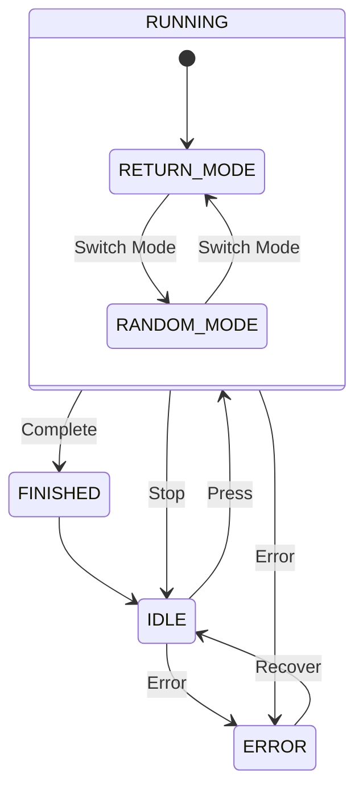

# P1-EMBD 双按键控制器
>类型：分析文档 - 需求分析
>来源：[[P1-EMBD Introduction]]
>日期：2026-7-9

## 状态定义

| State    | Description             |
| -------- | ----------------------- |
| IDLE     | Waiting for user input  |
| RUNNING  | Executing selected mode |
| FINISHED | Task completed          |
| ERROR    | Fault state             |

## 状态机示意图  

## 灯效定义
### 当前问题：现有 lightshow.c 与规范有差距

结论先说:**能复用 lightshow.c 的"引擎"(tick 循环、呼吸/闪烁数学、HSV、hal_strip 调用),但现有的 pattern 集、API 和颜色不能原样满足规范——要"加"东西。**"原封不动地复用"是做不到的,原因如下。

#### 现有 lightshow.c 与规范的具体差距

|规范要求|lightshow.c 现状|能否原样用|
|---|---|---|
|颜色由**状态**决定(白/黄绿/橙红)|颜色由**strip**硬编码([lightshow.c:28](vscode-webview://1di0rj3m68rtilivvsof2ar2qa51473mfp0b4lnv0lh12a90doum/index.html?id=6b97fe5b-3873-47aa-aeae-2060155bebd1&parentId=1&origin=001a7433-3674-40e6-b9d7-3b3b152b7734&swVersion=5&extensionId=Anthropic.claude-code&platform=electron&vscode-resource-base-authority=vscode-resource.vscode-cdn.net&parentOrigin=vscode-file%3A%2F%2Fvscode-app&session=9f246042-b9f3-498a-adaf-93dfa4fd276c) strip1 绿、strip2 蓝)|✗ 颜色模型不对|
|Idle 白色常亮|SOLID 存在,但色是绿/蓝|✗ 颜色|
|Running 黄绿呼吸,周期 2s,**30%–100%**|BREATHE 周期 200 ticks=2s ✓,但幅度是 **0–100%**|△ 周期对,下限要改|
|Finished 黄绿快闪**恰好 3 次**(100ms)后**自动回白常亮**|无计数、无自动跳转,BLINK 是无限循环|✗ 缺"计数一次性 + 自动返回"|
|Error 橙红快闪 250ms 持续|BLINK 周期固定 1000ms([lightshow.c:9](vscode-webview://1di0rj3m68rtilivvsof2ar2qa51473mfp0b4lnv0lh12a90doum/index.html?id=6b97fe5b-3873-47aa-aeae-2060155bebd1&parentId=1&origin=001a7433-3674-40e6-b9d7-3b3b152b7734&swVersion=5&extensionId=Anthropic.claude-code&platform=electron&vscode-resource-base-authority=vscode-resource.vscode-cdn.net&parentOrigin=vscode-file%3A%2F%2Fvscode-app&session=9f246042-b9f3-498a-adaf-93dfa4fd276c))|✗ 时序不可参数化|
|FSM **直接设定**某效果|只有 `next_pattern` 循环切换|✗ 缺"直接设定"接口|

还有一个硬约束:**同一条 strip 只能有一个 owner**。现在 main.c 每圈调 `lightshow_tick()`、按钮调 `lightshow_next_pattern()`。如果你另建一个新 LED 层去驱动同两条 strip,两者都会 `hal_strip_refresh` → 打架。所以不可能"旧演示灯效继续跑 + 新规范灯效并存"——**旧的"按钮循环切绿/蓝 pattern"这个演示行为一定会被取代**(它本来也不符合规范)。

#### 建议做法:把 lightshow 改造成"状态驱动的灯效层"(增量式)

保留文件和它的基础设施,做**加法**改动:

1. **新增一个 effect 枚举**(与 FSM 的 4 态对应),或直接让 FSM 传状态: `LIGHT_EFFECT_IDLE / RUNNING / FINISHED / ERROR`。
2. **新增直设接口**给 FSM 调:`void lightshow_set_effect(uint8_t strip, light_effect_t e);` —— 取代 `next_pattern` 的循环用法。
3. **颜色改由效果决定**(不再按 strip 硬编码),用宏占位(品牌黄绿/橙红的精确 RGB 是**待 ID 设计师确认**的,文档§53 有标注,先放占位值)。
4. **BREATHE 下限抬到 30%**:把 [lightshow.c:101](vscode-webview://1di0rj3m68rtilivvsof2ar2qa51473mfp0b4lnv0lh12a90doum/index.html?id=6b97fe5b-3873-47aa-aeae-2060155bebd1&parentId=1&origin=001a7433-3674-40e6-b9d7-3b3b152b7734&swVersion=5&extensionId=Anthropic.claude-code&platform=electron&vscode-resource-base-authority=vscode-resource.vscode-cdn.net&parentOrigin=vscode-file%3A%2F%2Fvscode-app&session=9f246042-b9f3-498a-adaf-93dfa4fd276c) 的 `0→255` 改成 `76(=30%)→255`。
5. **新增 FINISHED 计数闪烁**:亮 10 ticks/灭 10 ticks × 3 次后自动切回 IDLE(白常亮)。这是现有 BLINK 没有的"一次性 + 计数 + 自动返回"。
6. Error 用 25 ticks(250ms)的独立闪烁时序。

时序换算(10ms/tick):Running 200 ticks ✓、Finished 10/10×3、Error 25/25。

#### 关于"原有功能不做变动"

需要你确认一下你的意思,因为它决定改法:

- 如果指"**别破坏别的模块对 lightshow 的依赖**"——我查过,除了 main.c 的演示接线,没有别的模块依赖它的绿/蓝演示行为,所以放心改。
- 如果指"**演示用的循环切 pattern 也要保留能用**"——那和规范在同一对 strip 上是互斥的,做不到并存;只能保留代码不调用,或彻底移除。

我的推荐:**增量改造 lightshow.c**(加 effect 枚举 + `set_effect` 接口 + 状态配色 + FINISHED 计数闪),复用它现成的 tick/呼吸/HSV/hal_strip,旧的 `next_pattern` 循环演示予以取代。这样代码量最小、不新增会抢占 strip 的第二个模块。