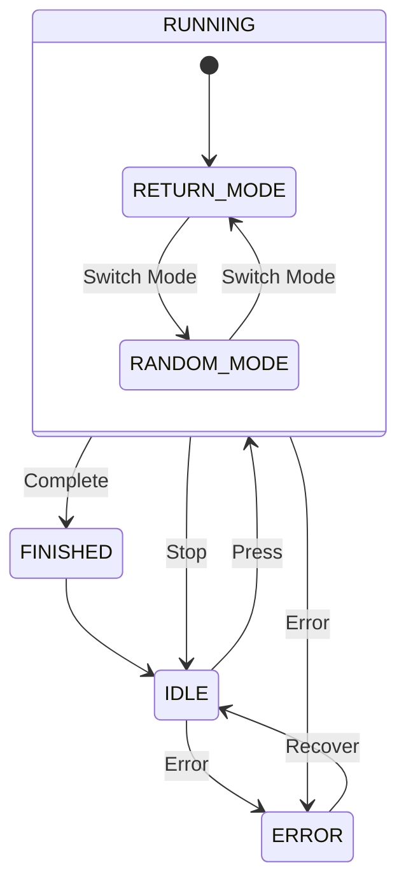

# P1-EMBD 双按键控制器
>类型：分析文档 - 需求分析
>来源：[[P1-EMBD Introduction]]
>日期：2026-7-9

## 状态机示意图  

## State Definition 

| State | Description            |    
| ----- | ---------------------- | 
| IDLE  | Waiting for user input |    
| RUNNING | Executing selected mode |     
| FINISHED | Task completed |      | ERROR | Fault state |